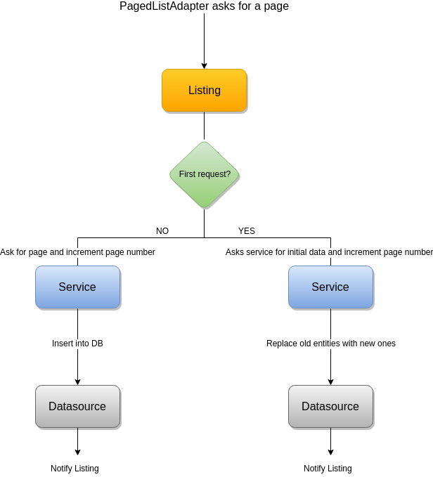

<p align="left">
<a href="https://jitpack.io/#xmartlabs/fountain"></a>
<a href="https://github.com/xmartlabs/fountain/master/LICENSE"></a>
<a href="https://circleci.com/gh/xmartlabs/fountain"></a>
<a href="https://codecov.io/gh/xmartlabs/fountain"></a>
<a href="https://codebeat.co/projects/github-com-xmartlabs-fountain-master"></a>
</p>

A smart and simple way to work with paged endpoints.
To see an example of how to use it, check out the introducing Fountain posts: [part one](https://blog.xmartlabs.com/2018/07/16/Introducing-Fountain-Part-One/) 
and [part two](https://blog.xmartlabs.com/2018/08/20/Introducing-Fountain-Part-Two/).


## Overview

Fountain is an Android Kotlin library conceived to make your life easier when dealing with paged endpoint services, where the paging is based on incremental page numbers (e.g. 1, 2, 3, ...).
It uses the [Google Android Architecture Components](https://developer.android.com/topic/libraries/architecture/), mainly the [Android Paging Library] to make it easier to work with paged services.

The main goal of the library is to easily **provide a [Listing] component from a common service specification**.
[Listing] provides essentially five elements to take control of the paged list:

```kotlin
data class Listing<T>(
    val pagedList: LiveData<PagedList<T>>,
    val networkState: LiveData<NetworkState>,
    val refreshState: LiveData<NetworkState>,
    val refresh: () -> Unit,
    val retry: () -> Unit
)
```

1. **pagedList:** A changing data stream of type `T` represented as a [`LiveData`](https://developer.android.com/topic/libraries/architecture/livedata) of a [`PagedList`](https://developer.android.com/reference/android/arch/paging/PagedList).
1. **networkState:** A stream that notifies network state changes, such as when a new page started loading (so you can show a spinner in the UI).
1. **refresh:** A refresh function, to refresh all data.
1. **refreshState:** A stream that notifies the status of the refresh request.
1. **retry:** A retry function to execute if something failed.

Basically, you could manage all data streams with a `Listing` component, which is awesome!
It's really flexible and useful to display the paged list entities and reflect the network status changes in the UI.

Fountain provides two ways to generate a `Listing` component from paged services:    
1. [**Network support:**](#network-support) Provides a `Listing` based on a common Retrofit service implementation.
Note entities won't be saved in memory nor disk.
1. [**Cache + Network support:**](#cache--network-support) Provides a `Listing` with cache support using a common Retrofit service implementation, and a [`DataSource`](https://developer.android.com/reference/android/arch/paging/DataSource) for caching the data.
We recommend you use [Room](https://developer.android.com/topic/libraries/architecture/room) to provide the `DataSource`, because it will be easier. However, you could use any other `DataSource`.

Fountain supports 2 types of Retrofit service adapters:
- A [RxJava2 retrofit adapter.](https://github.com/square/retrofit/tree/master/retrofit-adapters/rxjava2)
- A [Coroutine retrofit adapter.](https://github.com/JakeWharton/retrofit2-kotlin-coroutines-adapter)

It also supports not using any of them, as you could work with a simple Retrofit [call](https://square.github.io/retrofit/2.x/retrofit/retrofit2/Call.html).

## Download

Add library to project dependencies with JitPack.
```groovy
repositories {
    maven { url "https://jitpack.io" }
}

dependencies {
    // This dependency is required only if you want to use a Retrofit service without a special adapter. 
    implementation 'com.github.xmartlabs.fountain:fountain-retrofit:0.3.0'

    // This dependency is required only if you want to use a Coroutine retrofit adapter.
    implementation 'com.github.xmartlabs.fountain:fountain-coroutines:0.3.0'

    // This dependency is required only if you want to use a RxJava2 retrofit adapter.
    implementation 'com.github.xmartlabs.fountain:fountain-rx2:0.3.0'
}
```

> Despite Fountain is in experimental state, we believe the API won't receive major changes.

## Usage
You can read the [full documentation](https://xmartlabs.gitbook.io/fountain/).

### Factory constructors
There's one static factory object class for each each dependency.
- FountainCoroutines: Used to get a [Listing] from a Retrofit service which uses a Coroutine adapter.
- FountainRetrofit: Used to get a [Listing] from a Retrofit service without using an special adapter.
- FountainRx: Used to get a [Listing] from a Retrofit service which uses a RxJava2 adapter.

Each static factory has two constructors, one for each Fountain mode.

### Network support

The `Listing` with network support can be obtained invoking `createNetworkListing` from the static factory class.

It requires only one argument, a `NetworkDataSourceAdapter`, which provides all operations that the library will use to handle the paging.

The `NetworkDataSourceAdapter` contains two main functions: a method to check if a page can be fetched and a property to fetch it.

```kotlin
interface NetworkDataSourceAdapter<PageFetcher> {
  val pageFetcher: PageFetcher

  @CheckResult
  fun canFetch(page: Int, pageSize: Int): Boolean
}
```

`PageFetcher` is a structure that provides a way to fetch a page from a service call.
There is one page fetcher per library adapter, we will refer to any of them as `PageFetcher` throughout the documentation. 

```kotlin
interface RetrofitPageFetcher<T : ListResponse<*>> {
  fun fetchPage(page: Int, pageSize: Int): Call<T>
}

interface CoroutinePageFetcher<T : ListResponse<*>> {
  fun fetchPage(page: Int, pageSize: Int): Deferred<T>
}

interface RxPageFetcher<T : ListResponse<*>> {
  fun fetchPage(page: Int, pageSize: Int): Single<T>
}
```

#### List Responses

The library defines a common service response type which is used to fetch the pages.

```kotlin
interface ListResponse<T> {
  fun getElements(): List<T>
}
```

Additionally, there are other response types that can be used when the service provides more information in the response.

`ListResponseWithEntityCount`: Used when the service provides the amount of entities.

```kotlin
interface ListResponseWithEntityCount<T> : ListResponse<T> {
  fun getEntityCount() : Long
}
```

`ListResponseWithPageCount`: Used when the service provides the amount of pages.

```kotlin
interface ListResponseWithPageCount<T> : ListResponse<T> {
  fun getPageCount(): Long
}
```

If you use either `ListResponseWithPageCount` or `ListResponseWithEntityCount` you can convert a `PageFetcher` to a `NetworkDataSourceAdapter`.
That means that if the response has the number of pages or entities you can get a `NetworkDataSourceAdapter` without implementing the `canFetch` method.

To do that Fountain provides some extensions:
```kotlin
fun <ServiceResponse : ListResponseWithEntityCount<*>>
    PageFetcher<ServiceResponse>.toTotalEntityCountNetworkDataSourceAdapter(firstPage: Int)
fun <ServiceResponse : ListResponseWithPageCount<*>>
    PageFetcher<ServiceResponse>.toTotalPageCountNetworkDataSourceAdapter(firstPage: Int)
```

### Cache + Network support

The `Listing` with network and cache support can be obtained invoking `createNetworkWithCacheSupportListing` from the static factory class.

It has two required components: 
1. A `NetworkDataSourceAdapter<out ListResponse<NetworkValue>>` to fetch all pages.
1. A `CachedDataSourceAdapter<NetworkValue, DataSourceValue>` to update the `DataSource`.
It's the interface that the library will use to take control of the `DataSource`.

```kotlin
interface CachedDataSourceAdapter<NetworkValue, DataSourceValue> {
  fun getDataSourceFactory(): DataSource.Factory<*, DataSourceValue>

  @WorkerThread
  fun saveEntities(response: List<NetworkValue>)

  @WorkerThread
  fun dropEntities()

  @WorkerThread
  fun runInTransaction(transaction: () -> Unit)
}
```
It has only four methods that you should implement:
- `getDataSourceFactory` will be used to list the cached elements.
The returned value is used to create the [`LivePagedListBuilder`](https://developer.android.com/reference/android/arch/paging/LivePagedListBuilder).
- `runInTransaction` will be used to apply multiple `DataSource` operations in a single transaction. That means that if something fails, all operations will fail.
- `saveEntities` will be invoked to save all entities into the `DataSource`.
This will be executed in a transaction.
- `dropEntities` will be used to delete all cached entities from the `DataSource`.
This will be executed in a transaction.

### Caching strategy
The pagination strategy that **Fountain** is using can be seen in the following image:
<br> <p align="center">  </p>

It starts with an initial service data request.
By default the initial data requested is three pages, but this value can be changed, in the [`PagedList.Config`](https://developer.android.com/reference/android/arch/paging/PagedList.Config.html), using the [`setInitialLoadSizeHint`](https://developer.android.com/reference/android/arch/paging/PagedList.Config.html#initialLoadSizeHint) method.
This parameter can be set in the factory constructor method. 
When the service data comes from the service, all data is refreshed in the `DataSource` using the `CachedDataSourceAdapter`.
Note that the `Listing` component will notify that the data changed.

After that, the [Android Paging Library] will require pages when the local data is running low.
When a new page is required, the paging library will invoke a new service call, and will use the `CachedDataSourceAdapter` to save the returned data into the `DataSource`.

## Architecture recommendations

It's strongly recommended to integrate this component in a MVVM architecture combined with the Repository Pattern.
The `Listing` component should be provided by the repository.
The `ViewModel`, can use the different `Listing` elements, provided by the repository, to show the data and the network changes in the UI.

You can take a look at the [example project](/app) to see how everything comes together.


## Getting involved

* If you **want to contribute** please feel free to **submit pull requests**.
* If you **have a feature request** please **open an issue**.
* If you **found a bug** check older issues before submitting a new one.
* If you **need help** or would like to **ask a general question**, use [StackOverflow](http://stackoverflow.com/questions/tagged/fountain). (Tag `fountain`).

**Before contributing, please check the [CONTRIBUTING](CONTRIBUTING.md) file.**

## Changelog

The changelog for this project can be found in the [CHANGELOG](CHANGELOG.md) file.

## About
Made with ❤️ by [XMARTLABS](http://xmartlabs.com)

[Android Paging Library]: https://developer.android.com/topic/libraries/architecture/paging/
[Listing]: https://xmartlabs.gitbook.io/fountain/listing
