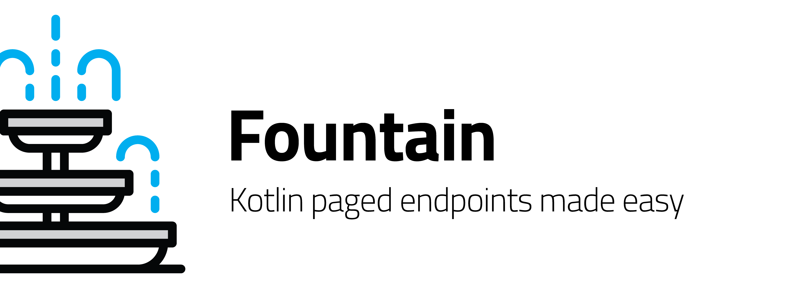

<p align="left">
<a href="https://github.com/xmartlabs/fountain/master/LICENSE"></a>
<a href="https://circleci.com/gh/xmartlabs/fountain"></a>
</p>

A smart and simple way to work with paged endpoints.

## Overview

Fountain is an Android Kotlin library conceived to make your life easier when dealing with paged endpoint services, where the paging is based on incremental page numbers (e.g. 1, 2, 3, ...).
It uses the [Google Android Architecture Components](https://developer.android.com/topic/libraries/architecture/), mainly the [Android Paging Library](https://developer.android.com/topic/libraries/architecture/paging/) to make it easier to work with paged services.

The main goal of the library is to easily provide a [Listing](fountain/src/main/java/com/xmartlabs/fountain/Listing.kt) component from a common service specification.
[Listing](fountain/src/main/java/com/xmartlabs/fountain/Listing.kt) provides essentially five elements to take control of the paged list:

```kotlin
data class Listing<T>(
    val pagedList: LiveData<PagedList<T>>,
    val networkState: LiveData<NetworkState>,
    val refreshState: LiveData<NetworkState>,
    val refresh: () -> Unit,
    val retry: () -> Unit
)
```

1. **pagedList:** A changing data stream of type `T` represented as a [`LiveData`](https://developer.android.com/topic/libraries/architecture/livedata) of a [`PagedList`](https://developer.android.com/reference/android/arch/paging/PagedList).
1. **networkState:** A stream that notifies network state changes, such as when a new page started loading (so you can show a spinner in the UI).
1. **refresh:** A refresh function, to refresh all data.
1. **refreshState:** A stream that notifies the status of the refresh request.
1. **retry:** A retry function to execute if something failed.

Basically, you could manage all data streams with a `Listing` component, which is awesome!
It's really flexible and useful to display the paged list entities and reflect the network status changes in the UI.

Fountain provides two ways to generate a `Listing` component from paged services:    
1. **Network support:** Provides a `Listing` based on a service that uses Retrofit and RxJava. Note entities won't be saved in memory nor disk.
1. **Cache + Network support:** Provides a `Listing` with cache support using a service based on Retrofit and RxJava, and a [`DataSource`](https://developer.android.com/reference/android/arch/paging/DataSource) for caching the data.
We recommend you use [Room](https://developer.android.com/topic/libraries/architecture/room) to provide the `DataSource`, because it will be easier. However, you could use any other `DataSource`.

## Download

Add library to project dependencies with JitPack.
```groovy
repositories {
    maven { url "https://jitpack.io" }
}

dependencies {
    implementation 'com.github.xmartlabs:fountain:${fountain_version}'
}
```

## Usage
You should read the documentation to use it, but the `Listing` can be provided by two methods.

### Network support
You can read the documentation [here]().

The `Listing` with network support can be obtained using:
```kotlin
Fountain.createNetworkListing(networkDataSourceAdapter)
```

There's only one required structure, `NetworkDataSourceAdapter<out ListResponse<Value>>`, which this library uses to handle the paging.
There are two methods: one to check if a page could be fetched and another one to fetch it.
```kotlin
interface PageFetcher<T> {
  @CheckResult
  fun fetchPage(page: Int, pageSize: Int): Single<out T>
}

interface NetworkDataSourceAdapter<T> : PageFetcher<T> {
  @CheckResult
  fun canFetch(page: Int, pageSize: Int): Boolean
}
```

### Cache + Network support

The `Listing` with network and cache support can be obtained using:

```kotlin
Fountain.createNetworkWithCacheSupportListing(
  networkDataSourceAdapter = networkDataSourceAdapter,
  cachedDataSourceAdapter = cachedDataSourceAdapter
)

```
There're two required components 
1. A `NetworkDataSourceAdapter<out ListResponse<Value>>` to fetch all pages.
1. A `CachedDataSourceAdapter<Value>` to update the `DataSource`.
It's the interface that the library will use to take control of the `DataSource`.

```kotlin
interface CachedDataSourceAdapter<Value> {
  fun getDataSourceFactory(): DataSource.Factory<*, Value>

  @WorkerThread
  fun saveEntities(response: List<Value>)

  @WorkerThread
  fun dropEntities()

  @WorkerThread
  fun runInTransaction(transaction: () -> Unit)
}
```
It has only four methods that you should implement:
- `getDataSourceFactory` will be used to list the cached elements.
The returned value is used to create the [`LivePagedListBuilder`](https://developer.android.com/reference/android/arch/paging/LivePagedListBuilder).
- `runInTransaction` will be used to apply multiple `DataSource` operations in a single transaction. That means that if something fails, all operations will fail.
- `saveEntities` will be invoked to save all entities into the `DataSource`.
This will be executed in a transaction.
- `dropEntities` will be used to delete all cached entities from the `DataSource`.
This will be executed in a transaction.

## Getting involved

* If you **want to contribute** please feel free to **submit pull requests**.
* If you **have a feature request** please **open an issue**.
* If you **found a bug** check older issues before submitting a new one.
* If you **need help** or would like to **ask a general question**, use [StackOverflow]. (Tag `fountain`).

**Before contributing, please check the [CONTRIBUTING](CONTRIBUTING.md) file.**

## Changelog

The changelog for this project can be found in the [CHANGELOG](CHANGELOG.md) file.

## About
Made with ❤️ by [XMARTLABS](http://xmartlabs.com)
